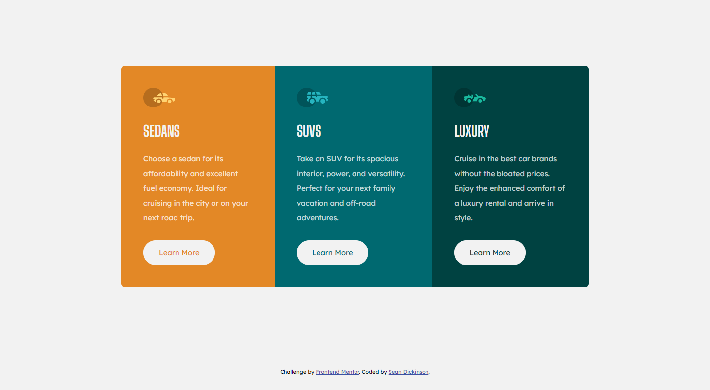

# Frontend Mentor - 3-column preview card component solution

This is a solution to the [3-column preview card component challenge on Frontend Mentor](https://www.frontendmentor.io/challenges/3column-preview-card-component-pH92eAR2-). Frontend Mentor challenges help you improve your coding skills by building realistic projects. 

## Table of contents

- [Overview](#overview)
  - [The challenge](#the-challenge)
  - [Screenshot](#screenshot)
  - [Links](#links)
- [My process](#my-process)
  - [Built with](#built-with)
- [Author](#author)

## Overview

### The challenge

Users should be able to:

- View the optimal layout depending on their device's screen size
- See hover states for interactive elements

### Screenshot

### Links

- Solution Code: [Github Repo](https://github.com/atinybeardedman/3-column-preview-card-component)
- Live Site URL: [https://fervent-elion-6665fb.netlify.app](https://fervent-elion-6665fb.netlify.app)

## My process

I approached this project using a mobile first workflow and trying to use best practices in terms of git/github. I began the project by initializing a repo with the starter files and set up CD hosting deployments using Netlify. 

I first established a branch for beginning to create the html structure. Once I had completed the html structure I pushed the branch to github to merge into main before beginning work on the next feature (css).

I built out the css trying to break the file down into sections based on large feature groups such as typography, layout, and finally the components themselves. I used some naming conventions similar to utility classes from various css frameworks for the colors. 

Once I built out the mobile design I switched to the desktop and implemented it within a single media query. 

Finally I added the active states for the buttons with a transition.

### Feedback

- I felt conflicted in whether to stick with utility based css classes or more component based classes. I think what I came up with is clear, however I'd be interested to see if anyone thinks it would be better to commit one way or the other.

- I think the colors might have been easier to implement using css variables, particularly for the buttons as the inversion does not allow for utility based naming.

### Built with

- Semantic HTML5 markup
- Flexbox
- Mobile-first workflow

## Author

- Website - [Sean Dickinson](https://seandickinson.dev)
- Frontend Mentor - [@atinybeardedman](https://www.frontendmentor.io/profile/atinybeardedman)
